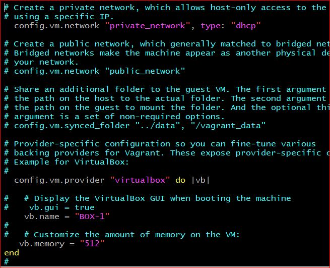
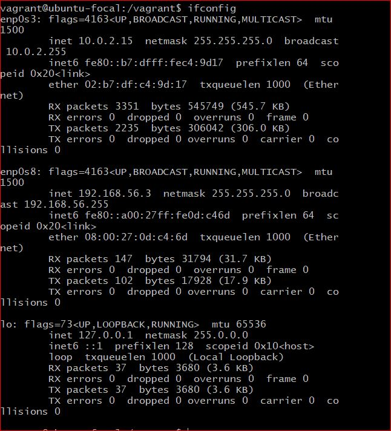

### This Folder contains exercise 1 files.

## Exercise 1

### Task: Setup Ubuntu 20.04 on your local machine using vagrant

### Instruction:
Customize your Vagrantfile as necessary with private_network set to dhcp
Once the machine is up, run ifconfig and share the output in your submission along with your Vagrantfile in a folder for this exercise

# Answers

### my customed Vagrantfile

### see below for the output of ifconfig command

